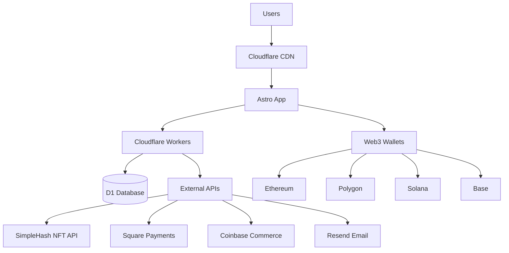

# Architecture Overview

EtchNFT is built as a modern, scalable web3 application using a serverless-first architecture. The platform is designed for global performance, security, and reliability while maintaining the flexibility to integrate with multiple blockchain networks.

## High-Level Architecture

## Core Components

### Frontend Layer

**Astro Framework**
- Server-side rendering for optimal SEO and performance
- Island architecture for selective React hydration
- Built-in optimizations for images, fonts, and assets

**React Components**
- Interactive UI components with state management
- Web3 wallet integration via RainbowKit
- Shopping cart and order management

**Styling & UI**
- Tailwind CSS for rapid development
- Custom design system with retro-futuristic aesthetics
- Responsive design optimized for all devices

### Backend Layer

**Cloudflare Workers**
- Serverless edge computing for global performance
- API endpoints for NFT data, orders, and authentication
- Smart contract integration and Web3 transaction handling
- Payment webhook processing for Square and Coinbase
- Automatic scaling and minimal cold starts

**D1 Database**
- Serverless SQLite database with global replication
- ACID transactions for order consistency
- Smart contract escrow tracking and order management
- RBAC system with role-based permissions
- Automated backups and point-in-time recovery

**Smart Contract Layer**
- Solidity contracts deployed on multiple networks
- Escrow functionality for secure payments
- Admin controls for emergency refunds
- Multi-chain deployment support (Ethereum, Polygon, Base, Optimism)

### Authentication & Security

**Lucia Auth**
- Session-based authentication with secure cookies
- GitHub OAuth integration for admin access
- CSRF protection and secure session management

**Data Protection**
- No private key storage or custodial access
- Read-only NFT data access via public APIs
- PCI DSS compliant payment processing

## Data Flow

### NFT Discovery Flow

1. **Wallet Connection**
   - User connects Web3 wallet (MetaMask, WalletConnect, etc.)
   - Wallet address is detected across multiple networks
   - No private keys are accessed or stored

2. **NFT Enumeration**
   - SimpleHash API queries user's NFT holdings
   - Metadata is fetched and cached for performance
   - Images are optimized and served via CDN

3. **Display & Interaction**
   - NFTs are displayed with rich metadata
   - Users can filter, search, and select NFTs
   - Real-time ownership verification

### Order Processing Flow

1. **Order Creation**
   - User selects NFTs and customization options
   - Order data is validated and stored in D1
   - Inventory and pricing checks are performed
   - Smart contract escrow initiated for Web3 payments

2. **Payment Processing**
   - Square handles traditional payments (cards, Apple Pay)
   - Coinbase Commerce processes cryptocurrency payments
   - Smart contract escrow locks funds for Web3 orders
   - Payment webhooks confirm transaction completion
   - Payment confirmation triggers order fulfillment

3. **Fulfillment**
   - Order details are sent to fulfillment system
   - Laser etching specifications are generated
   - Quality control and production tracking
   - Smart contract escrow released upon completion
   - Shipping labels and tracking are created

4. **Notifications**
   - Email confirmations via Resend
   - SMS updates for shipping milestones
   - Blockchain transaction confirmations
   - Push notifications for mobile app users

5. **Order Management**
   - 24-hour cancellation window with automatic refunds
   - Emergency refund capability after 30 days
   - Admin refund system with audit trails
   - Certificate of authenticity generation

## Technology Choices

### Why Astro?
- **Performance**: Zero JS by default, selective hydration
- **SEO**: Built-in SSR and static generation
- **Developer Experience**: Familiar React/Vue syntax
- **Flexibility**: Mix multiple frameworks as needed

### Why Cloudflare Workers?
- **Global Performance**: 300+ edge locations worldwide
- **Scalability**: Automatic scaling to handle traffic spikes
- **Cost Efficiency**: Pay-per-use pricing model
- **Security**: Built-in DDoS protection and WAF

### Why D1 Database?
- **Edge Performance**: Data close to users globally
- **Serverless**: No database management overhead
- **Consistency**: ACID transactions for critical operations
- **Integration**: Native Cloudflare Workers integration

### Why RainbowKit/Wagmi?
- **Multi-Wallet**: Support for 100+ wallets
- **Type Safety**: Full TypeScript support
- **Chain Agnostic**: Easy multi-chain development
- **Active Development**: Regular updates and improvements

## Scalability Considerations

### Performance Optimization

**CDN Strategy**
- Static assets served from Cloudflare CDN
- Image optimization with automatic WebP/AVIF
- Aggressive caching for NFT metadata

**Database Optimization**
- Read replicas for global data access
- Connection pooling and query optimization
- Automated indexing for common queries

**API Rate Limiting**
- Per-user and per-IP rate limits
- Graceful degradation under load
- Cache warming for popular NFT collections

### Monitoring & Observability

**Performance Monitoring**
- Core Web Vitals tracking
- Real User Monitoring (RUM)
- Synthetic monitoring for critical paths

**Error Tracking**
- Automatic error collection and alerting
- Performance regression detection
- User session replay for debugging

**Business Metrics**
- Order conversion funnels
- NFT collection popularity
- Geographic usage patterns

## Security Architecture

### Data Protection
- TLS 1.3 encryption for all traffic
- Content Security Policy (CSP) headers
- Secure cookie configuration with SameSite
- No private key storage (non-custodial design)
- Webhook signature verification (Square, Coinbase)

### Access Control
- Role-based access control (RBAC) system
- GitHub OAuth for admin authentication
- API authentication with secure session tokens
- Admin API key protection for sensitive operations
- Rate limiting to prevent abuse

### Smart Contract Security
- Multi-chain deployment with consistent security
- Escrow protection for customer funds
- Admin emergency controls with timelock mechanisms
- Signature verification for wallet interactions
- Reentrancy guards and overflow protection

### Compliance
- GDPR compliance for EU users
- PCI DSS compliance for payment processing
- SOC 2 compliance for enterprise customers
- Legal document templates (ToS, Privacy Policy, Purchase Agreement)

## Future Architecture Plans

### Planned Enhancements

**Multi-Region Deployment**
- Active-active deployment across regions
- Cross-region database replication
- Intelligent traffic routing

**Microservices Evolution**
- Service decomposition for complex workflows
- Event-driven architecture with message queues
- Independent scaling of critical components

**Advanced NFT Features**
- Dynamic NFT support
- Cross-chain NFT bridging
- AI-powered etching optimization
- Custom NFT minting and upload system
- Farcaster Frame integration
- Compressed NFT support (Solana)

This architecture provides a solid foundation for EtchNFT's current needs while maintaining flexibility for future growth and feature development.